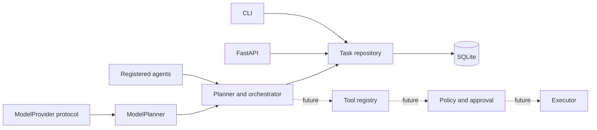

# Lucifer architecture

The existing desktop assistant remains available through `python main.py`. The new
`lucifer/` package is the modular operating layer. Keeping it separate avoids silently
changing the desktop application's behavior while the new security boundaries mature.

## Phase 1 boundaries

- `core/tasks.py` owns the task schema and lifecycle vocabulary. New tasks are `PENDING`.
- `storage/repository.py` is the persistence contract; `storage/database.py` implements it
  with SQLAlchemy and SQLite. The API and CLI share the same database setting.
- `agents/base.py`, `models/provider.py`, and `tools/registry.py` define extension points.
  No agents, providers, or executable tools are registered yet.
- The API accepts task submissions and retrieves task state. It has no execution endpoint.
- Configuration comes from process environment variables and the repository `.env`
  file, with process variables taking precedence.
- The database is private to the local user where POSIX permissions apply. The HTTP
  API has no authentication, so bind it to loopback only during local development.

## Dependencies and acceptance

The foundation uses Python 3.12+, FastAPI and Pydantic v2 for HTTP contracts,
SQLAlchemy 2 with SQLite for persistence, `python-dotenv` for optional configuration
file loading, and Ruff, mypy, pytest, and HTTPX for checks. These are declared in
`pyproject.toml` under the `foundation` and `dev` extras.

Phase 1 is accepted when the API starts locally, health responds, task creation
returns a validated `PENDING` record with a trace ID, task retrieval works after
an application restart, the CLI uses the same database, and the focused Ruff,
mypy, and pytest checks pass.

## Phase 2 boundary

`core/planner.py` validates a bounded directed acyclic graph. `ModelPlanner` accepts
only schema-valid JSON from an injected provider. `core/router.py` selects a registered
agent by capability. `core/orchestrator.py` persists the graph, runs dependencies in
order, applies agent timeouts and retry policy, and records each transition. The
verifier runs separately after each agent result. See [task lifecycle](task-lifecycle.md)
for every state transition.

There is no default provider or agent. The orchestrator is composed programmatically
with trusted implementations; the HTTP API still only submits and reads tasks.
Tool definitions remain metadata with no execution entry point. Policy, approvals,
and auditing are required before tools can be connected to agents.
